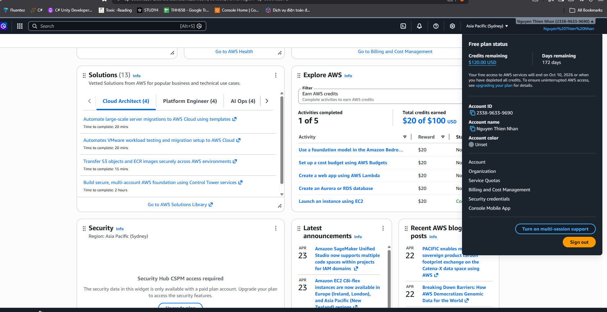
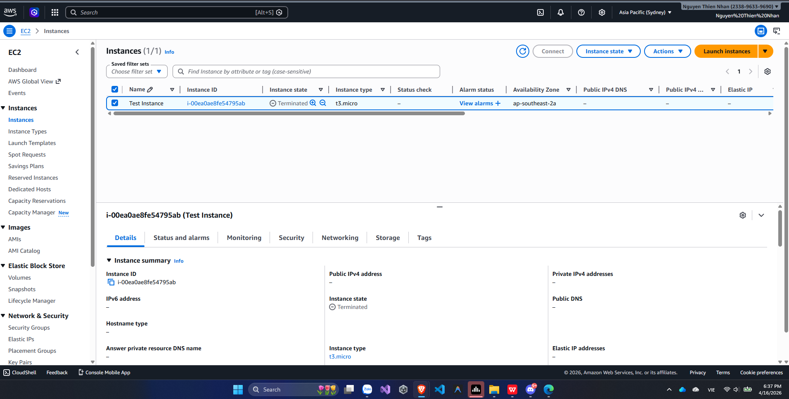
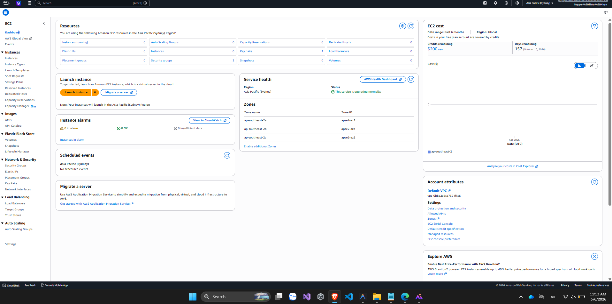

{}
⚠️ **Note:** The information below is for reference purposes only. Please **do not copy it directly** into your internship report, including this warning.
{}

### Week 1 Objectives:

* Get acquainted with the members of the First Cloud Journey program.
* Understand the basic AWS services and learn how to use the AWS Management Console and AWS CLI.

### Tasks to be completed this week:

| Day | Tasks | Start Date | Completion Date | Reference |
| --- | ----- | ---------- | --------------- | --------- |
| Mon | - Get to know the FCJ members   - Read and understand the internship rules and regulations | 17/04/2026 | 17/04/2026 | <https://hcm-rules.awsfcaj.com/> |
| Tue | - Learn about AWS and its service categories  &emsp; + Compute  &emsp; + Storage  &emsp; + Networking  &emsp; + Database  &emsp; + Other AWS services | 18/04/2026 | 19/04/2026 | <https://cloudjourney.awsstudygroup.com/> |
| Wed | - Create an AWS Free Tier account   - Learn about AWS Management Console and AWS CLI   - **Hands-on Practice:**  &emsp; + Create an AWS account  &emsp; + Install and configure AWS CLI  &emsp; + Learn how to use AWS CLI | 20/04/2026 | 20/04/2026 | <https://cloudjourney.awsstudygroup.com/> |
| Thu | - Learn the fundamentals of Amazon EC2  &emsp; + Instance Types  &emsp; + Amazon Machine Images (AMI)  &emsp; + Elastic Block Store (EBS)  &emsp; + Other EC2 concepts   - Explore different methods of connecting to EC2 via SSH   - Learn about Elastic IP | 21/04/2026 | 21/04/2026 | <https://cloudjourney.awsstudygroup.com/> |
| Fri | - **Hands-on Practice:**  &emsp; + Launch an EC2 instance  &emsp; + Connect via SSH  &emsp; + Attach an EBS volume | 22/04/2026 | 22/04/2026 | <https://cloudjourney.awsstudygroup.com/> |
| Sat | - Explore additional AWS services  &emsp; - Learn more through YouTube tutorials | 23/04/2026 | 23/04/2026 | <https://www.youtube.com/@AWSStudyGroup> |

### Week 1 Achievements:

* Gained a fundamental understanding of AWS and its core service categories:
  * Compute
  * Storage
  * Networking
  * Database

* Successfully created and configured an AWS Free Tier account.

 

* Became familiar with the AWS Management Console and learned how to navigate, access, and manage AWS services through the web interface.

* Installed and configured AWS CLI, including:
  * Access Key
  * Secret Access Key
  * Default Region

* Used AWS CLI to perform basic operations such as:
  * Checking account information and CLI configuration
  * Listing available AWS Regions
  * Viewing EC2 resources
  * Creating and managing Key Pairs
  * Checking the status of running AWS services

* Successfully launched a **t3.micro EC2 instance**, connected to it via SSH, and terminated the instance after completing the practice.

 

* Learned how to monitor and manage AWS resources through the EC2 Dashboard.

 

* Developed the ability to manage AWS resources using both the AWS Management Console and AWS CLI.